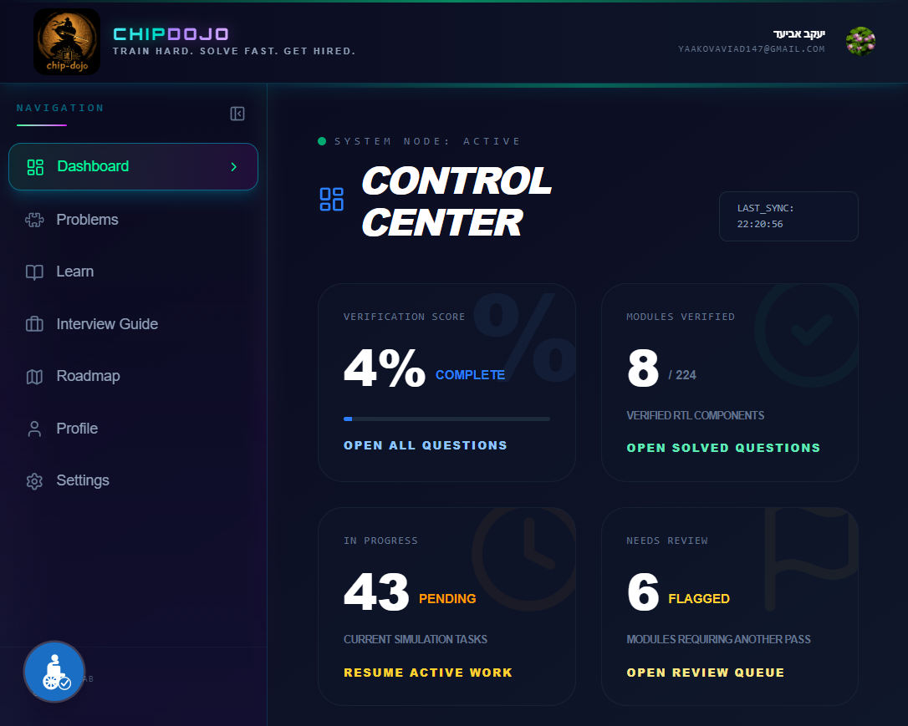
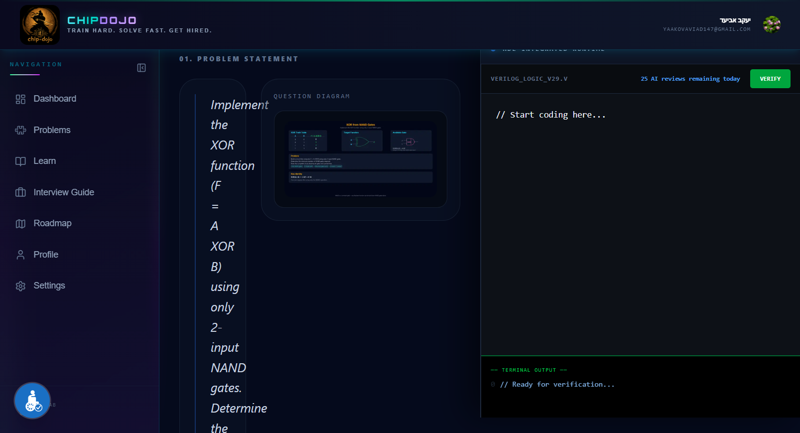
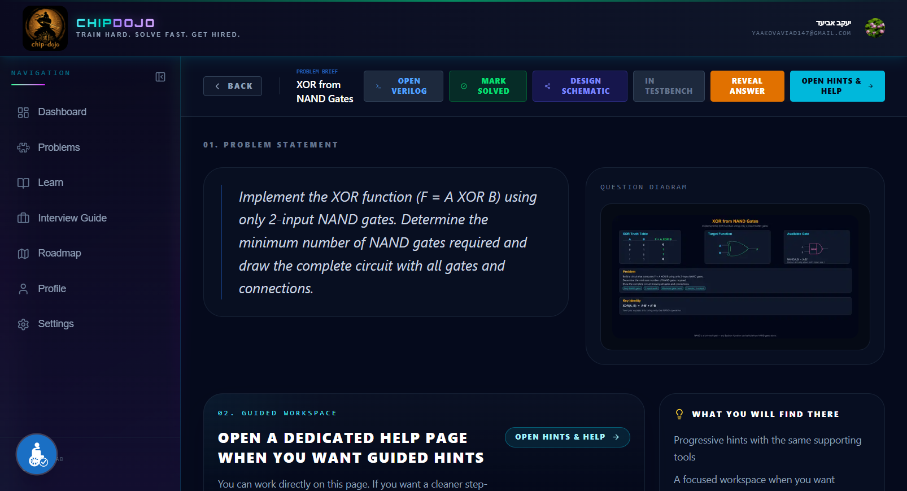
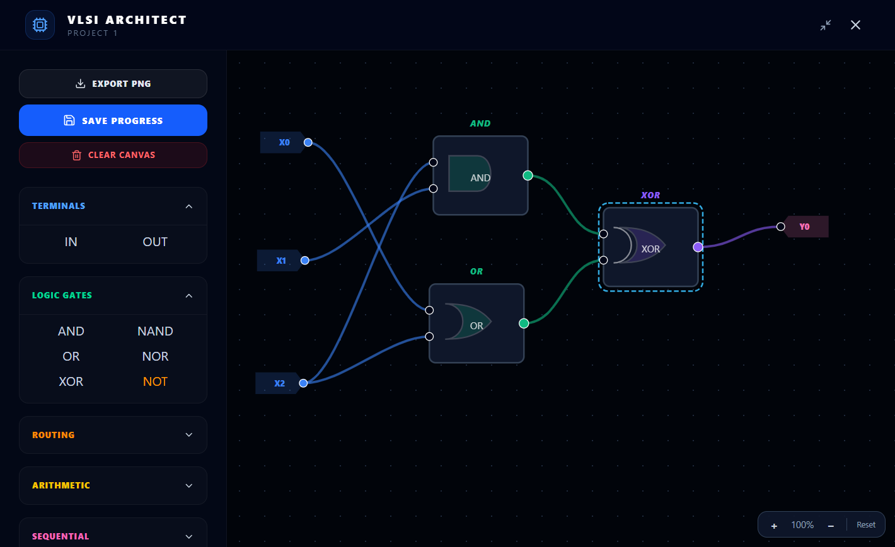

<h1 align="center">Chip Dojo</h1>
<p align="center">
  <strong>An interactive learning platform for digital hardware design and chip-engineering interviews.</strong>
</p>

<p align="center">
  <a href="https://www.chipdojo.com/"></a>
  
  
  
</p>

> **Note:** This repository is a public overview of the project.
> The full source code lives in a private repository.
> Visit the live product at **[chipdojo.com](https://www.chipdojo.com/)**.

---

## 🎯 What is Chip Dojo?

Chip Dojo is a web platform that helps engineers and students prepare for **digital-design and ASIC/FPGA interviews** the same way LeetCode prepares software engineers.

Instead of toy problems, every puzzle is built around a real hardware-design scenario — combinational circuits, sequential logic, FSMs, transistor-level networks, and architectural reasoning — and is paired with:

- A **problem image** (block diagram / waveform / truth-table skeleton)
- A guided **hints layer** that nudges without spoiling
- A full **solution writeup** with annotated schematic
- An **in-browser Verilog editor** with **AI-powered verification** that checks both syntax and logical correctness against the spec

The platform currently ships with **300+ curated puzzles** across six categories.

---

## 🖼️ Screenshots

<p align="center">
  
  <br><em>Architectural Lab dashboard — puzzles grouped by topic with live progress tracking.</em>
</p>

<p align="center">
  
  <br><em>Monaco-based Verilog editor with AI verification: instant feedback on syntax and behavior.</em>
</p>

<p align="center">
  
  <br><em>Problem / Hints / Solution flow with schematics generated from source files.</em>
</p>

<p align="center">
  
  <br><em>Visual Builder — drag-and-drop circuit composer with per-user cloud persistence.</em>
</p>

---

## 🧩 Core Features

| Feature | Description |
|---|---|
| **Curated puzzle library** | 300+ problems across Combinational, Sequential, FSM, Transistor-Level, Logical Reasoning, and Coding categories |
| **AI Verilog verification** | Backend route validates user code against problem spec using Google Gemini, with structured JSON feedback |
| **Visual Builder** | Drag-and-drop schematic editor with per-user, per-question cloud-saved projects |
| **Progress tracking** | Per-puzzle status (Solved / In Progress / Needs Review), success-rate analytics, attempt history |
| **Learning paths** | Roadmap, study guides, and interview-prep tracks |
| **Auth & billing** | Clerk-based authentication, Stripe & Lemon Squeezy subscription flows, invite-only beta access |
| **Custom diagram pipeline** | All puzzle artwork is generated from source files (Python/Pillow for hardware, Graphviz for FSMs) — no hand-drawn SVG drift |

---

## 🏗️ Architecture

```
┌──────────────────────────────────────────────────────────────────┐
│                         Next.js 16 (App Router)                  │
│                                                                  │
│   ┌──────────────┐    ┌─────────────────┐   ┌────────────────┐   │
│   │  Marketing   │    │   Dashboard     │   │ Visual Builder │   │
│   │   /  pages   │    │ /problems,/learn│   │     (canvas)   │   │
│   └──────────────┘    └────────┬────────┘   └────────┬───────┘   │
│                                │                     │           │
│                       Zustand store (client) ────────┘           │
└───────────────────────────────┬──────────────────────────────────┘
                                │
                                ▼
┌──────────────────────────────────────────────────────────────────┐
│                     API Routes (Edge / Node)                     │
│                                                                  │
│  /api/verify-verilog  →  Google Gemini  (AI grading)             │
│  /api/visual-builder  →  Supabase       (project persistence)    │
│  /api/user-state      →  Supabase       (progress sync)          │
│  /api/stripe/*        →  Stripe         (subscriptions)          │
│  /api/checkout-guest  →  Lemon Squeezy  (one-off purchases)      │
│  /api/contact         →  Resend         (transactional email)    │
└──────────────────────────────────────────────────────────────────┘
                                │
                                ▼
┌──────────────────────────────────────────────────────────────────┐
│  Auth: Clerk     │  DB: Supabase (Postgres + RLS)                │
│  Hosting: Vercel │  Static assets: Vercel CDN                    │
└──────────────────────────────────────────────────────────────────┘
```

### Tech stack

- **Framework:** Next.js 16 (App Router, React 19, Server Components)
- **Language:** TypeScript (strict)
- **Styling:** Tailwind CSS v4
- **State:** Zustand with cloud-sync hooks + `localStorage` fallback
- **Editor:** Monaco (`@monaco-editor/react`) configured for Verilog
- **Auth:** Clerk
- **Database:** Supabase (Postgres, Row-Level Security, dedicated tables for `user_states` and `visual_builder_projects`)
- **AI:** Google Gemini (`@google/generative-ai`) for code verification
- **Payments:** Stripe + Lemon Squeezy (dual gateway)
- **Email:** Resend
- **Diagrams:** Custom Python (Pillow) + Graphviz (JS) toolchain — all puzzle artwork is reproducible from source
- **Hosting:** Vercel

### Security highlights

- Server-side enforcement of OWASP Top 10 (input validation, parameterized queries, secret isolation, RLS on every table)
- AI keys never reach the browser — all model calls go through authenticated server routes
- Per-route rate limiting on AI and write endpoints
- Webhook signature verification for both Stripe and Lemon Squeezy

---

## 🔗 Links

- 🌐 **Live site:** [chipdojo.com](https://www.chipdojo.com/)
- 💼 **LinkedIn:** [linkedin.com/company/chipdojo](https://www.linkedin.com/company/chipdojo/)
- ✉️ **Contact:** [chipdojono1@gmail.com](mailto:chipdojono1@gmail.com)

---

## 📄 About this repo

This repo intentionally contains only this overview.
The full production codebase (300+ commits) is private to protect proprietary puzzle content, AI grading prompts, and billing logic.

> 💡 **Note for recruiters:** The low public commit count on my GitHub profile reflects private development activity. All active work on Chip Dojo lives in a private repository. I'm happy to provide a live walkthrough, share specific modules, or discuss any part of the implementation in detail.

If you're a recruiter or hiring engineer and would like a code walkthrough or live demo, please reach out via the contact links above.

---

<p align="center"><sub>© 2026 Chip Dojo. All rights reserved.</sub></p>
